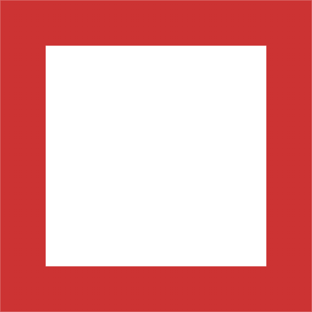
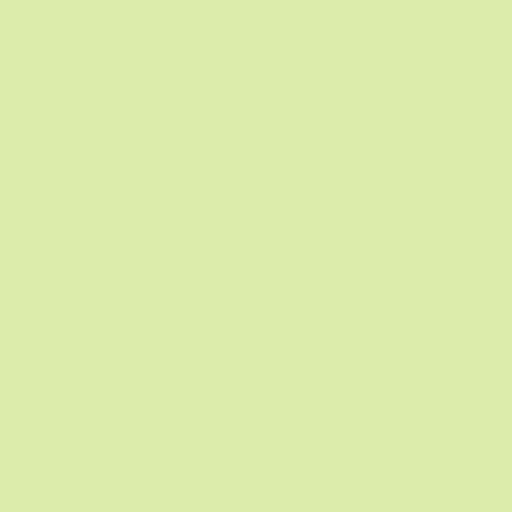
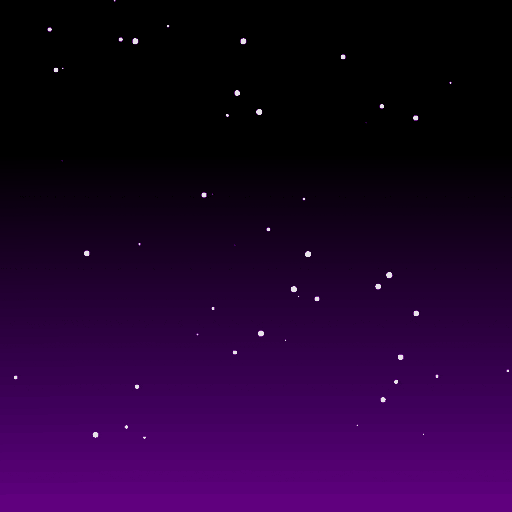
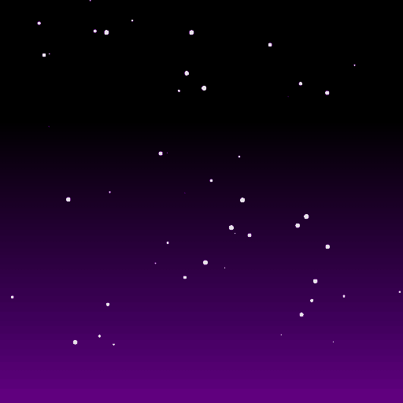
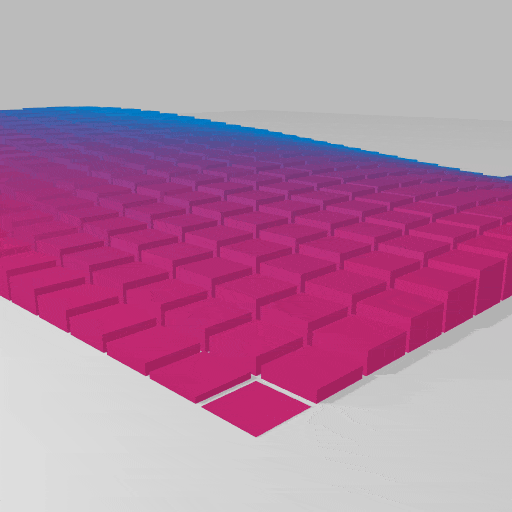
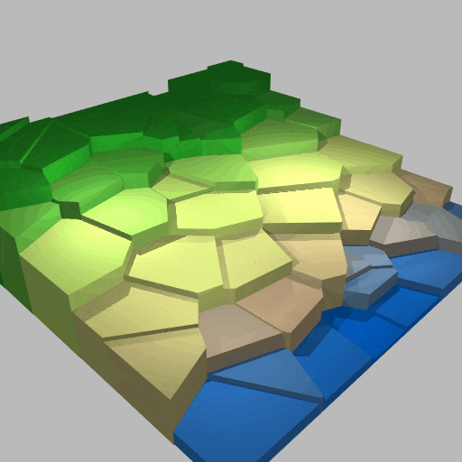
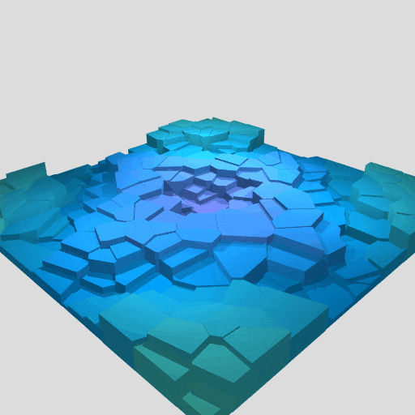
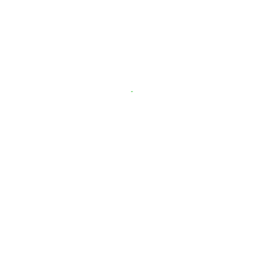
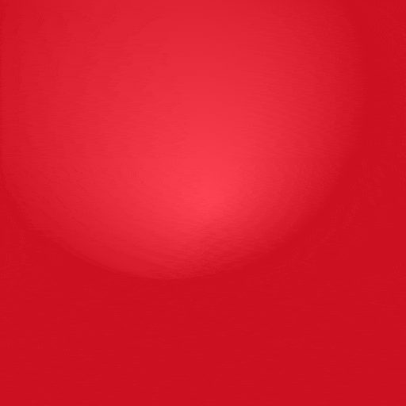
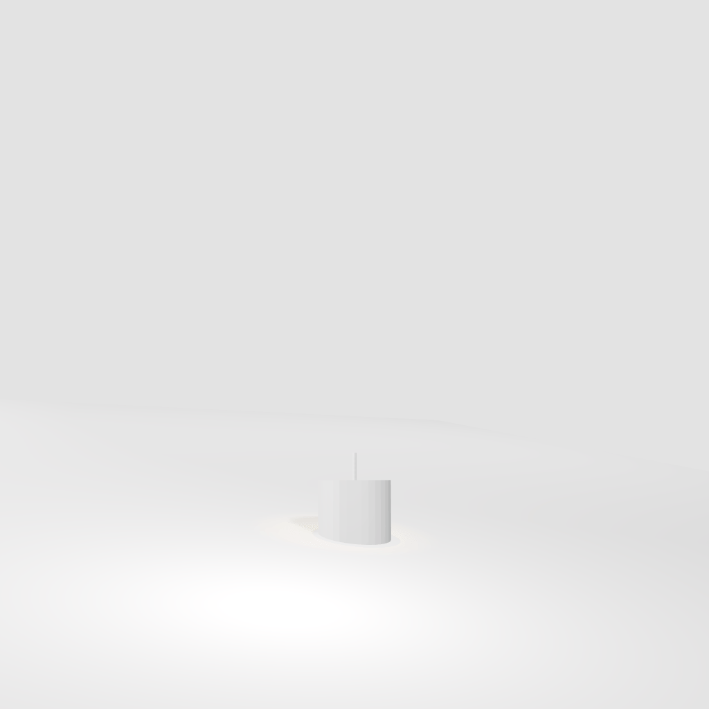

# Sketches

A set of experiments using canvas-sketch and Three.js

| | | | | | | |
:-------------------------:|:-------------------------:|:-------------------------:|:-------------------------:|:-------------------------:|:-------------------------:|:-------------------------:
  |  |  |  |  |  |  |
  |  |  |  |  |  |  |
  |  | 
